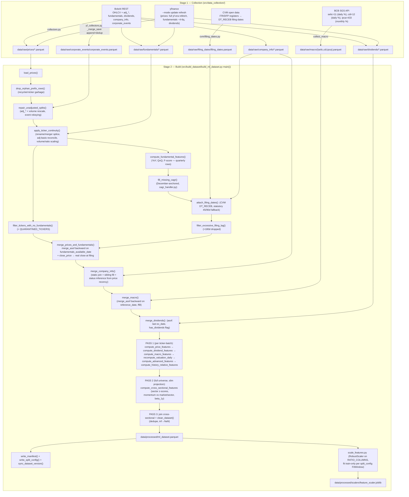

# Pipeline Forensic Audit — 2026-07-23

Read-only audit of the full pipeline (Stage 1 collection → Stage 2 build →
scaler). No code was modified. Findings verified empirically against
`data/processed/ml_dataset.parquet` (1,318,989 rows, 515 tickers) and raw
parquets where noted. Checkboxes = not yet fixed.

**Status (2026-07-23, post-fix):** all Critical/High issues (1-5) and most
Medium/Low issues fixed in commits `c0a52b8`, `287d40c`, `9ea26f1`. Three
items are partial/deferred by deliberate choice, not oversight — see their
entries below: Issue 8 (docs only, no code fix possible without a larger CVM
sourcing project), Issue 9b (terminal-event payoff, already tracked as a
separate planned task in `continuity.py`), Issue 11 (fundamentals YoY/QoQ/
F-score fixed; `cagr_handler.py`'s 20-quarter lookback deliberately left
untouched), Issue 12 (self-exclusion fixed as of this date; BOVA11-as-
benchmark routing then deferred — **superseded, see §4: routed through
2026-07-24**).

**Status (2026-07-24/25, red-team follow-up):** a second, independent pass
(§4) hunted for defects the above audit's own methodology couldn't catch —
second-order effects and things the fix-verification step didn't check for
sign/denominator correctness. Found and fixed 5 more real bugs (Issues
16-20, commits `511ec09`, `5baa503`, `d1aad62`, `d959522`, `eb63656`),
revisited and implemented Issue 12's previously-deferred BOVA11 routing
(Issue 21, commit `57527cc`), investigated but did NOT implement a
split-matcher persistence guard (Issue 22, two designs both regressed real
data — investigation documented in commit `b739c12`), and fixed a stale
test (`005fecb`) and a pre-existing pandas FutureWarning (`cc6aacf`) both
surfaced by rebuilding. See §4 for full detail and §5 for one retracted
candidate finding (verified NOT a bug before any code was touched).

## 1. Data Flow Diagram

## 2. Audit Report

### Critical

- [x] **Issue 1: `real_return`, `excess_return`, and `earnings_yield_vs_selic` use wrong macro units** (`src/build_dataset/features.py:309-322,546`)
  - **Severity:** Critical
  - **Why it matters for Quant Finance:** The comment in `compute_macro_features` says "selic/ipca are annual %; divide by 252," but the collected series are not annual: SGS 11/12 (selic/cdi) are **% per day** (values ~0.05) and SGS 433 (ipca) is **% per month** (values ~0.2–1.0). Verified in the built dataset: `real_return` subtracts a mean of 0.00185/day when the true daily inflation equivalent is ~0.00022/day — an 8.3x over-subtraction that biases `real_return` by roughly −34%/yr (its dataset mean is −0.165%/day, economically impossible). `excess_return` subtracts 0.00016/day vs the true ~0.00040/day (2.5x under-subtraction, ~+6pp/yr bias). `earnings_yield_vs_selic` subtracts `selic/100` = a *daily* decimal (~0.0005) from an *annualized* earnings yield, so the intended macro comparison (~0.14) is absent and the feature is just `earnings_yield` with noise. Three features are systematically wrong; any model consuming them learns distorted risk premia.
  - **Proposed Fix:** In `compute_macro_features`: `excess_return = log_return - np.log1p(selic/100)` (selic is already daily %; log1p for consistency with log returns). For inflation, convert monthly to daily: `real_return = log_return - np.log1p(ipca/100)/21`. In `compute_advanced_features`, annualize selic before comparing: `earnings_yield_vs_selic = earnings_yield - ((1 + selic/100)**252 - 1)`. Document the per-series units in `config.BCB_SERIES` so the next consumer doesn't repeat this.

### High

- [x] **Issue 2: IPCA look-ahead — monthly inflation is visible from the 1st of the month it measures** (`src/build_dataset/merge.py:199-236`)
  - **Severity:** High
  - **Why it matters for Quant Finance:** SGS 433 stamps month M's inflation at `reference_date = M-01`, but IBGE publishes IPCA around the 10th of month M+1. `merge_macro`'s `merge_asof(..., direction="backward")` + ffill gives every trading day inside month M the full-month M print — information published ~40 days in the future. This leaks directly into the raw `ipca` feature and into `real_return` (Issue 1). A backtest conditioning on `ipca` gets an inflation-nowcast edge no live model would have.
  - **Proposed Fix:** Shift IPCA's availability date before the asof merge: either fetch the actual release calendar, or conservatively set `available_date = reference_date + MonthEnd(1) + 15 days` (always after the real release) and `merge_asof` on that. Same review should be applied to any future monthly BCB series; daily selic/cdi are same-day-known and fine.

- [x] **Issue 3: `selic_trend_20d` bleeds across ticker boundaries and imports future data** (`src/build_dataset/features.py:320`)
  - **Severity:** High
  - **Why it matters for Quant Finance:** `df["selic"] - df["selic"].shift(20)` runs on the whole ticker-blocked batch without `groupby("ticker")`. The first 20 rows of every ticker subtract the *previous ticker's last rows'* selic — typically a 2026 value subtracted from a year-2000 row. Verified: 511/515 tickers have a non-NaN `selic_trend_20d` on their very first row (impossible for a correct 20-day trailing diff), with garbage magnitudes up to ±0.06. It is both wrong (compares unrelated dates) and a look-ahead (a ticker's earliest rows see dataset-end rate levels).
  - **Proposed Fix:** Compute per ticker: `df["selic_trend_20d"] = df.groupby("ticker")["selic"].transform(lambda s: s - s.shift(20))` — or better, compute it once on the deduplicated macro date grid (`selic_by_date.diff(20)`) and map onto rows by `trade_date`, which is also ~500x cheaper and makes the boundary problem structurally impossible.

- [x] **Issue 4: `div_yield_12m` divides nominal dividends by dividend/split-adjusted price** (`src/build_dataset/features.py:61-113`)
  - **Severity:** High
  - **Why it matters for Quant Finance:** Trailing-12m dividends are nominal per-share amounts at their ex-dates, but the denominator is `adj_close`, which is discounted backward from "now" by every dividend and split since. The mismatch grows with distance from the present: verified on BBAS3, the yield reads 6.8% vs the true 2.9% in 2010 and 13.0% vs 5.7% in 2015, converging to correct only near dataset-end. The feature has a built-in secular downtrend that a model will read as "yields structurally compressed," and cross-sectional comparisons at a given historical date are distorted by each ticker's differing cumulative adjustment. `div_yield_sector_percentile` (cross_sectional.py) inherits this.
  - **Proposed Fix:** Compute yield on a consistent basis. Simplest correct form: sum per-event yields — for each dividend, `value_per_share / close_at_ex_date` (nominal ÷ nominal, same day, immune to later adjustments), then `div_yield_12m` = trailing sum of those event yields. Alternatively convert each dividend to the adjusted basis (`value_per_share × adj_close/close at ex-date`) before dividing by today's `adj_close`.

- [x] **Issue 5: `status` (and to a lesser degree `sector`) are current-day snapshots joined onto all history** (`src/build_dataset/merge.py:92-192`)
  - **Severity:** High (known/documented — restated here for completeness)
  - **Why it matters for Quant Finance:** `merge_company_info` stamps today's ATIVO/CANCELADA onto every historical row; a model reading `status` at a 2012 row is told whether the company survived to 2026 — textbook feature-level survivorship leakage. The status-inference and "CANCELADA but recently trading" overrides also use `trade_date.max()` (dataset-end knowledge). `sector` is the same static join used inside `compute_cross_sectional_features`, so sector z-scores/momentum use 2026 sector classifications historically (companies do migrate sectors; lower information content, but nonzero). CLAUDE.md documents `status` and places the exclusion burden on consumers — that burden is easy to miss.
  - **Proposed Fix:** Minimum: exclude `status` from every model-facing feature list mechanically (e.g. record it in the scaler metadata / a `NON_FEATURE_COLS` constant consumed by downstream code, not just prose). Better long-term: source point-in-time listing status from the CVM register (already collected for filing dates) and join as-of.

### Medium

- [x] **Issue 6: Same-day visibility of fundamentals (`merge_asof` exact-match on filing date)** (`src/build_dataset/merge.py:50-57`)
  - **Severity:** Medium
  - **Why it matters for Quant Finance:** `merge_asof(..., direction="backward")` includes exact matches, so a filing whose `DT_RECEB` is day T is attached to day T's row. CVM receipt timestamps are date-granular (verified: all midnight) and companies routinely file after the trading session; a strategy evaluated at T's close would often not have had those numbers intraday. This is a mild but systematic optimistic skew on the freshest quarter — exactly the rows where fundamentals moves prices.
  - **Proposed Fix:** Make fundamentals visible from T+1: `merge_asof(..., allow_exact_matches=False)`, or add one day to `fundamentals_available_date` at attach time. Update `test_merge_honors_actual_filing_date` accordingly.

- [x] **Issue 7: Frozen BolsAI era vs re-adjusted yfinance era — a growing adj_close discontinuity at the junction** (`src/data_collection/yf_collectors.py:74-96`)
  - **Severity:** Medium (small today, grows every quarter)
  - **Why it matters for Quant Finance:** `_prices_fetch_start` correctly re-fetches the whole yfinance era each `--mode update`, keeping that era internally consistent. But yfinance's `auto_adjust` discounts rows backward from "now," while the BolsAI-era rows before the junction are frozen at their 2026 backfill basis. Every dividend a ticker pays from now on lowers the yfinance-era rows relative to the frozen BolsAI rows, opening a fake negative `log_return` exactly at the junction date — one per ticker, compounding quarterly. Today the measured basis gap is negligible (first update cycle); after a few years of quarterly updates it will look like the same class of splice bug already fixed once in `continuity.py`.
  - **Proposed Fix:** Reconcile at the junction the same way `apply_ticker_continuity` does: after each yfinance refetch, compute the ratio between the stored BolsAI adj_close at the last BolsAI date and the freshly implied yfinance adj basis at that same date, and rescale the incoming yfinance-era `adj_*` by it (anchor yfinance to the frozen BolsAI basis, not vice-versa — BolsAI rows must stay untouched per the no-reconstruction rule).

- [~] **Issue 8: Fundamentals *values* may be restated; only availability *dates* are point-in-time** (`src/data_collection/collectors.py:260-302`, `src/build_dataset/quality_filters.py:183-235`)
  - **Severity:** Medium
  - **Why it matters for Quant Finance:** `filing_dates.py` deliberately takes the *earliest* CVM receipt (v1) as the availability date ("the market saw the numbers at v1") — but the numbers themselves come from BolsAI's current `/fundamentals/history`, which almost certainly reflects the latest restatement. Where a company restated (common after auditor review of ITRs), the dataset shows corrected figures at the original v1 date — information nobody had then. This is an as-reported vs as-restated mismatch, a classic subtle lookahead in fundamental factors.
  - **Proposed Fix:** No clean fix with BolsAI alone. The CVM open-data ZIPs already being downloaded (`cvm/statements.py`) contain every filing *version*; a point-in-time-strict build could source as-first-reported figures from CVM v1 filings for the overlap universe. Cheaper interim: document the caveat in CLAUDE.md, and quantify it once by diffing CVM v1 vs BolsAI current values on a sample to size the effect.
  - **Status:** Documented as a known caveat in CLAUDE.md (the "cheaper interim" option above). No code fix — not attempted, matches the proposed fix's own assessment that a real fix needs a larger CVM v1-sourcing project.

- [~] **Issue 9: Residual survivorship: dead tickers with zero fundamentals are dropped, and delistings end silently** (`src/build_dataset/quality_filters.py:87-156`, `src/build_dataset/continuity.py`)
  - **Severity:** Medium
  - **Why it matters for Quant Finance:** Two mechanisms tilt the panel toward survivors: (a) `filter_tickers_with_no_fundamentals` removes tickers whose fundamentals BolsAI never covered — disproportionately old delisted names, i.e. exactly the failure cases; (b) a delisted/bankrupt ticker's series simply stops — there is no terminal event (tender cash-out, bankruptcy → ~−100%) — so any return computed over "held to the end" positions never realizes the loss. The universe work (85 CANCELADA collected, keep_separate handling) mitigates the classic form, but the built dataset still under-represents catastrophic outcomes.
  - **Proposed Fix:** (a) Log the dropped-for-no-fundamentals tickers into the manifest so universe studies can quantify the bias; where CVM statements exist for them (`cvm/statements.py` pipeline), backfill fundamentals from CVM instead of dropping. (b) Add a per-ticker terminal-event row/flag (`delist_date`, `delist_type`, terminal payoff where known — tender price from the continuity map) so downstream labels can realize the final return. The continuity map's `tender` entries already carry the intent.
  - **Status:** (a) done — `filter_tickers_with_no_fundamentals` now returns a structured `dropped_report`, recorded in `ml_dataset.manifest.json` as `dropped_no_fundamentals`. (b) not done — terminal-event payoff is a bigger feature addition than a bug fix, and was already tracked as a separate planned task in `continuity.py`'s own docstring ("terminal-event payoff handling is a separate planned task — see DELISTED_UNIVERSE.md") before this audit; left as-is rather than scope-creeping it in here.

### Low

- [x] **Issue 10: Rolling-percentile features use `min_periods=1` — degenerate warm-up values instead of NaN** (`src/build_dataset/features.py:457-499`)
  - **Severity:** Low
  - **Why it matters for Quant Finance:** `volatility_*_percentile`, `price_percentile_*`, `pl_percentile_5y`, `drawdown_percentile` all rank within a rolling window with `min_periods=1`: a ticker's first row is always percentile 1.0 and early rows rank inside tiny windows. Causally safe (no future data) but statistically noise, and inconsistent with the pipeline's own warm-up policy (every other rolling feature is NaN until its window fills). Young listings get systematically extreme percentile features.
  - **Proposed Fix:** Set `min_periods` to a meaningful floor (e.g. 63 trading days, or 252 to match the zhist convention) and let the warm-up be NaN like the rest of the pipeline.

- [~] **Issue 11: Quarter-window arithmetic is positional, not calendar** (`src/build_dataset/features.py:276-297`, `src/build_dataset/cagr_handler.py:56-104`)
  - **Severity:** Low
  - **Why it matters for Quant Finance:** YoY growth (`pct_change(4)`), F-score `shift(4)`, 4-quarter trends, and the 20-quarter CAGR lookback all assume contiguous quarterly rows. A missing vendor quarter silently stretches "1 year ago" to 15 months, mislabeling growth rates. Prefix-shaped-NaN tests cover column NaNs, not absent quarter *rows*. Coverage is mostly contiguous today, so impact is small — but it's unguarded.
  - **Proposed Fix:** Guard with dates: after computing, NaN-out rows where the shifted row's `reference_date` isn't within (say) 350–380 days (for 4q) / 4.75–5.25y (for 20q) of the current row's; or reindex each ticker's fundamentals onto a complete quarterly grid before differencing.
  - **Status:** `compute_fundamental_features`'s YoY/QoQ/F-score (`features.py`) fixed with a date-gap guard (`_within_calendar_gap`); measured 1.89% of real fundamentals rows affected. `cagr_handler.py`'s 20-quarter December-anchored lookback deliberately left untouched — its broadcast logic is already delicate and heavily tested, it's a fallback path only used when BolsAI's own CAGR is missing, and the risk of a rewrite outweighed this Low-severity finding.

- [x] **Issue 12: Market/beta reference is a self-inclusive equal-weighted universe mean; collected benchmark BOVA11 is unused** (`src/build_dataset/cross_sectional.py:93-111`, `src/build_dataset/quality_filters.py:73-75`)
  - **Severity:** Low
  - **Why it matters for Quant Finance:** `beta_1y` and `momentum_vs_market_*` benchmark against the equal-weighted mean of whatever tickers exist that day — microcap-heavy, composition-shifting (thin in early years), and including the stock itself (self-inclusion shrinks relative momentum, materially so on thin early dates). Meanwhile BOVA11 is collected precisely as the IBOV proxy but is excluded by the no-fundamentals filter before ever being used. Betas vs an equal-weight all-share index differ meaningfully from betas vs IBOV.
  - **Proposed Fix:** Route BOVA11 through as the market series for beta (exempt it from the filter for this purpose only, or load it separately in `compute_cross_sectional_features`); for momentum-vs-market, either exclude self from the mean (`(sum - x)/(n-1)`) or accept and document the EW-universe definition.
  - **Status:** Self-exclusion fixed 2026-07-23 for both `momentum_vs_market_*` and `beta_1y`. BOVA11-as-true-benchmark routing was initially deferred (documented as a considered-and-deferred option in `cross_sectional.py`) on the assumption it would change dataset shape. **Reversed 2026-07-24 (§4, Issue 21):** implemented with BOVA11 threaded through as a pure external reference series, never a row in the output dataset — avoids the dataset-shape objection entirely, only redefines beta_1y/momentum_vs_market_*'s formula. Both self-exclusion (the equal-weighted-panel-mean design that no longer applies to these two column groups) and BOVA11 routing are now done.

- [x] **Issue 13: Trailing-12m dividend sum mixes pre/post-split nominal values within the window** (`src/build_dataset/features.py:93-107`)
  - **Severity:** Low
  - **Why it matters for Quant Finance:** When a split falls inside the trailing 365-day window, pre-split per-share dividends (big nominal) are summed with post-split ones and divided by one price — overstating yield for up to a year after every split. Bounded (only split-adjacent windows) but bunched exactly at corporate-event dates where other features are also stressed.
  - **Proposed Fix:** Folded into the Issue 4 fix: summing per-event yields (`value/close_at_ex_date`) makes each event self-normalizing and eliminates this window mixing too.

- [x] **Issue 14: `amihud_illiquidity` denominator uses adjusted, not traded, currency volume** (`src/build_dataset/features.py:234`)
  - **Severity:** Low
  - **Why it matters for Quant Finance:** `volume * adj_close` understates actual traded currency in deep history (adj_close carries dividend discounts; raw `traded_amount` exists in the schema), inflating historical Amihud levels with a secular trend. The within-ticker `amihud_illiquidity_zhist_5y` largely neutralizes this; the raw column and its cross-sectional use retain the drift. Split-consistency is fine (volume was rescaled with prices).
  - **Proposed Fix:** Use `traded_amount` (or `volume * close`) as the denominator; keep the zhist variant unchanged.

- [x] **Issue 15: CDI/SELIC daily-% and IPCA monthly-% units are undocumented at the schema level** (`src/data_collection/config.py`, dataset columns `selic`, `cdi`, `ipca`)
  - **Severity:** Low
  - **Why it matters for Quant Finance:** The raw macro columns pass through to the dataset in heterogeneous units (% per day vs % per month). Issue 1 shows even this repo's own feature code misread them; any downstream consumer is one comment away from the same bug.
  - **Proposed Fix:** Alongside the Issue 1 fix, either normalize all three to a common convention at load time (e.g. annualized decimal) with the raw units preserved under suffixed names, or at minimum record units in the manifest's column stats and CLAUDE.md.
  - **Status:** Units documented in `config.py`/manifest's `column_units`. Went further than "at minimum": `merge_macro` also adds `ipca_daily_equiv` (geometric decompounding to the same daily footing as selic/cdi) alongside the raw `ipca` column, so a future consumer has a safe column to reach for instead of repeating Issue 1's bug.

## 3. Checked and found sound

- **Fundamentals asof-merge** (backward on real CVM `DT_RECEB`, statutory fallback), **close_price replacement**, **filing-lag filter ordering** (features computed before rows are dropped, so positional YoY windows aren't corrupted by the filter).
- **Timezone alignment:** all sources land as naive dates (BolsAI naive, BCB naive, yfinance tz-dropped via `tz_localize(None)` from America/Sao_Paulo — date-preserving for B3). No cross-source date skew found.
- **Rolling features are causal:** percentile ranks use rolling (not global) rank; zhist features are trailing-inclusive; split repair and continuity splicing verified consistent with volume scaling; dividend files under post-rename names do cover pre-rename history (verified B3SA3/VBBR3/TIMS3/YDUQ3), so no dividend loss across splices.
- **Split config / scaler:** date-based split, train-only RobustScaler fit via injected FitWindow; transform preserves column order.
- **clean_dataset** inf→NaN and `_safe_ratio` near-zero-denominator guards; loaders' implausible-dividend gate (PDGR3-class vendor error).

## 4. Follow-up Audit — 2026-07-24/25 (red-team pass)

A second, independent read-through was commissioned specifically to find what
the first pass's own methodology couldn't: it had verified proposed fixes
existed and matched expected *magnitude*, but hadn't independently re-derived
*sign*/*denominator* correctness, and its `LOOKAHEAD_TAINTED_COLS` guard
tracked tainted *inputs* (`status`) without checking whether the taint
propagates into *derived* numeric columns. All findings below were verified
against real code and, where practical, real production data before being
called bugs — Issue 20's math (§5) was independently re-derived and found to
be correct, so no code was changed for it despite an initial claim otherwise.

- [x] **Issue 16: Split-repair volume scaling was dividing by the factor instead of multiplying** (`src/build_dataset/repair.py:151` at the time)
  - **Severity:** Critical (silently wrong on every repaired event, blast radius = all 67)
  - **Why it matters for Quant Finance:** `repair_unadjusted_splits()` correctly divides pre-event `adj_*` prices by the split factor, but was ALSO dividing `volume`/`volume_adjusted` by the same factor — the code's own comment said "multiplies volume by 4," contradicting the code. A 1:4 split needs pre-event volume scaled UP by 4 (more new-share-equivalent shares trading the same dollar activity) to keep `volume × price` invariant across the splice; dividing both compounds the discontinuity instead of removing it. No test asserted the *direction*, only that prices rescaled correctly, so this went undetected since the volume-rescale feature was first added.
  - **Fix:** Changed `/=` to `*=` for `VOLUME_COLS`. Added a regression test asserting the direction explicitly (confirmed it fails against the pre-fix code: expected 40,000, old code gave 2,500). Corrects `turnover_ratio`/`volume_ratio_20d` at every one of the 67 repaired historical split events.

- [x] **Issue 17: Cross-sectional exclude-self mean's denominator counted NaN peers the numerator had already dropped** (`src/build_dataset/cross_sectional.py:31-56` at the time)
  - **Severity:** High
  - **Why it matters for Quant Finance:** `_exclude_self_mean()` (added 2026-07-23 to fix Issue 12's self-inclusion bug) computed `(group_sum - self) / (group_size - 1)`, where `group_sum` came from a NaN-skipping `groupby("sum")` but `group_size` came from `groupby("ticker").transform("size")` — a blanket row count that includes tickers whose value is still undefined (e.g. `return_12m`'s warm-up year). The denominator counted peers the numerator had silently dropped, biasing every excluded-self mean toward zero — worse on thin, young-universe dates, exactly where `momentum_vs_market_*`/`beta_1y` matter most. Confirmed by hand: 4 tickers with one NaN peer, correct mean 0.015, buggy code gave 0.01.
  - **Fix:** Derive both sum and count from the value column's own `groupby("count")`/`("sum")` (both NaN-skipping) instead of a blanket ticker count. Added a direct unit test on the helper and an integration test with a NaN peer through the public entry point; verified the pre-fix function fails the new test. (Note: this helper and the columns it fed were themselves later replaced by Issue 21's BOVA11 routing for the market-facing columns; the fix and its lesson about NaN-skipping denominators remain relevant to any future panel-mean pattern in this codebase.)

- [x] **Issue 18: Sector-derived cross-sectional columns not recorded as lookahead-tainted** (`src/build_dataset/manifest.py:30`)
  - **Severity:** Medium
  - **Why it matters for Quant Finance:** `LOOKAHEAD_TAINTED_COLS` listed only `status`. But 6 `cross_sectional.py` columns — `pl_zscore_sector`, `pvp_zscore_sector`, `roe_zscore_sector`, `debt_equity_zscore_sector`, `div_yield_sector_percentile`, `momentum_vs_sector_{1m,3m,12m}` — are engineered directly from that same static, current-day `sector` join, and carry the identical taint laundered into a numeric z-score/percentile/momentum figure that reads as clean. A consumer who dutifully excluded raw `status`/`sector` per the mechanical guard was still training on the same 2026 sector classification applied to 2012 rows through these derived columns. This is exactly the kind of gap a taint-tracking mechanism is supposed to close, and the original audit's Issue 5 fix didn't extend to it.
  - **Fix:** Added all 6 columns to `LOOKAHEAD_TAINTED_COLS`. `momentum_vs_market_*` is deliberately NOT included — it groups by `trade_date` only, not `sector`, so it doesn't carry this particular taint (see Issue 21 for its own, different survivorship concern).

- [x] **Issue 19: `days_since_fundamental` keyed to the fiscal quarter-end, not real availability** (`src/build_dataset/features.py:525` at the time)
  - **Severity:** Low
  - **Why it matters for Quant Finance:** Computed `trade_date - reference_date` (the fiscal period-end the filing *describes*) instead of `trade_date - fundamentals_available_date` (when the market actually *saw* the filing) — understating true information age by the entire 45-90+ day filing lag on every row, and inconsistent with `filing_lag_days`/`n_quarters_available` in the same function, which already use the real availability date.
  - **Fix:** Changed to `trade_date - fundamentals_available_date`. Added a regression test asserting the new formula and that it no longer matches the old one; updated 3 existing test fixtures that previously omitted the now-required `fundamentals_available_date` column.

- [x] **Issue 20: `payout_ratio`/`dividend_coverage_ratio` treated one dividend event as the annual amount** (`src/build_dataset/features.py:489,498` at the time)
  - **Severity:** Low/Medium
  - **Why it matters for Quant Finance:** Both used `div_value_recent` — the single most-recent ex-date's nominal payment (`merge_dividends`' asof merge) — as if it were the whole year's dividend. Correct only for an annual payer; understates payout / inflates coverage for any company paying quarterly or more often, and stair-steps discontinuously at every ex-date instead of evolving smoothly like every other trailing-window feature in this pipeline (`div_yield_12m`, `div_count_12m`).
  - **Fix:** Added `div_value_12m` to `compute_dividend_features()` — a trailing-12m nominal sum of per-event `value_per_share`, same window/convention as `div_yield_12m` (which sums per-event *yield*) and `div_count_12m` — and switched both ratios to use it. `div_value_recent` is unchanged and still a legitimate "size of the last payment" feature on its own. Two new tests (trailing sum over 3 quarterly payments; zero when no dividends collected).

- [x] **Issue 21: BOVA11 not routed through as the market benchmark (revisits Issue 12)** (`src/build_dataset/cross_sectional.py`, `src/build_dataset/build_ml_dataset.py`)
  - **Severity:** Low, but structural — a second, benchmark-level survivorship bias distinct from the universe-selection-level one
  - **Why it matters for Quant Finance:** Even after Issue 12's self-exclusion fix, `beta_1y`/`momentum_vs_market_*` still benchmarked against the equal-weighted mean return of whatever tickers happened to be in the *collected panel* on that date — silently redefining "the market" as "the companies that survived to dataset-end." BOVA11 (the real IBOV-proxy ETF, collected for exactly this purpose) was excluded from the calculation entirely, dropped upstream for having no fundamentals.
  - **Fix:** `build_ml_dataset.main()` now captures BOVA11's rows right after `apply_ticker_continuity()` (before the fundamentals-coverage filter drops it), runs it through the same `compute_price_features()` as every other ticker for methodological consistency (same split-repair/continuity treatment, same return-window conventions), and threads the resulting trade_date/log_return/return_1m/3m/12m series through `compute_features_chunked()` into `compute_cross_sectional_features()`, which now takes it as a required `benchmark` argument. `beta_1y` and `momentum_vs_market_*` are computed against this single shared series (merged by exact `trade_date`) instead of the old per-ticker self-excluded panel mean; `_exclude_self_mean()` is removed as dead code. **BOVA11 itself never becomes a row in the output dataset** — threaded through purely as an external reference series — so this sidesteps Issue 12's original "changes dataset shape" objection entirely (that objection assumed BOVA11 would need to become a ticker row itself); only the *definition* of these two feature groups changes, not row/ticker counts or manifest fingerprinting. Verified against real production data: VALE3's `beta_1y` comes out ~0.72-0.75 vs the real IBOV proxy, economically plausible for a commodity miner. `momentum_vs_sector_*` is unaffected (no equivalent "benchmark" concept applies to sector-relative comparison).

- [~] **Issue 22: Split-matcher has no persistence guard against a coincidental market move being mistaken for a split** (`src/build_dataset/repair.py`)
  - **Severity:** Theoretical / defense-in-depth (zero confirmed instances)
  - **Why it matters for Quant Finance:** The single-day jump/tolerance match (`JUMP_MATCH_TOL`) can't distinguish a genuine permanent split/rebasing from an ordinary (if large) one-day market move that happens to land inside a recorded event's matching window and coincidentally matches its factor. A false match would permanently rescale a ticker's entire prior `adj_*` history off one unrelated trading day.
  - **Investigation:** Checked all 67 real repaired events for signs of a misfire using the untouched raw `close` series (unaffected by the repair) — persistence held for every one (post-jump level doesn't revert). Two independent persistence-guard designs were then implemented and tested against the real dataset as defense-in-depth: (1) comparing the post-jump window to the matched event's own factor broke 27 legitimate events (multi-step re-anchorings like TIMS3's /10000 arriving as two /100 jumps 2 days apart — the post-window for the first step already contains the second, not-yet-applied step, so the true combined move is ~100x bigger than any single factor); (2) a looser "reject only on reversion" redesign still broke 8 more — BGIP4, CASH3, LUXM4, PATI4, RANI3, and SBSP3's matches all trace to genuinely recorded `corporate_events.parquet` entries (confirmed by direct inspection: PATI4's ~annual small bonus-share splits, SBSP3's clustered restructuring sequence), whose ordinary volatility swamps any threshold loose enough to admit them.
  - **Status:** Not implemented. Zero actual misfires found anywhere in the current dataset; both attempted fixes demonstrably broke real, correct data with no offsetting benefit. Reverted both attempts, left a `ponytail:`-style comment in `repair.py` documenting the investigation and why no threshold safely separates "real small/clustered split" from "hypothetical market-move misfire" without materially more complexity in already-delicate matching logic. Revisit only if a future ticker's repair is found to have actually misfired.

**Two additional, non-audit fixes surfaced during this pass:**

- **Stale regression test:** `test_final_dataset.py`'s "asof merge picks most recent filed quarter" check reconstructed expected visibility using an inclusive `<=` comparison against `trade_date` — but the actual merge has used `allow_exact_matches=False` since Issue 6's fix (a filing is visible from T+1, not T itself), and this test's own reconstruction was never updated to match. It silently disagreed with the pipeline's correct, intentional behavior ever since Issue 6 landed, surfacing only once a rebuild's fixed `random_state=0` sample happened to land on an exact filing-date row. Fixed to strict `<`; verified this resolves all 5 sampled mismatches from the rebuild that triggered it.
- **Pre-existing pandas FutureWarning:** `repair.py`'s in-place `volume`/`volume_adjusted` rescale (`*=`/`/=` on a slice of an `int64` column with a non-integer factor) triggers a deprecation warning that will become a hard error in a future pandas version. Predates this session (the old `/=` had the identical issue). Fixed by casting `VOLUME_COLS` to `float64` once before the repair loop instead of leaving them `int64` until the existing final `.round().astype("int64")` cleanup; verified with the warning promoted to a hard error against real production data.

## 5. Retracted candidate finding (verified NOT a bug)

- **`real_return`'s inline IPCA conversion vs the `ipca_daily_equiv` column:** Initially flagged as a possible unit-consistency bug (Issue 1-style) because `real_return` computes `np.log1p(ipca/100)/21` inline instead of routing through the `ipca_daily_equiv` column added for exactly this kind of safety. Verified by direct derivation before any code was touched: `ipca_daily_equiv = ((1+ipca/100)^(1/21) - 1) × 100` is an exact geometric decompounding, so algebraically `log1p(ipca_daily_equiv/100) == log1p(ipca/100)/21` — confirmed numerically to float-noise precision (1e-16). The two formulas are mathematically identical; `real_return`'s existing formula was never wrong. No code change made. Recorded here so this isn't rediscovered as a false lead.
